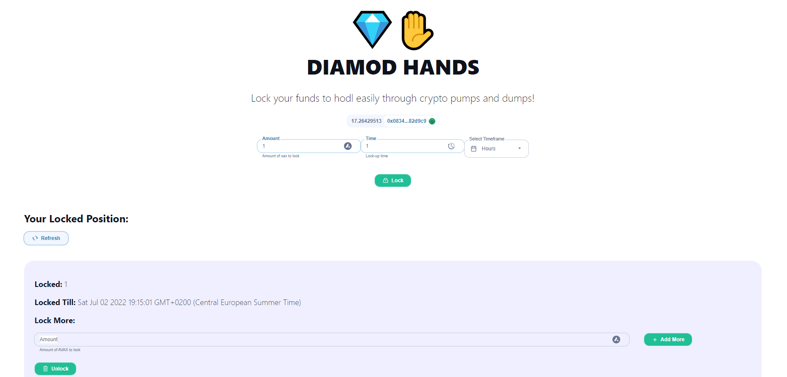

# Diamond Hands

This is a blockchain application, wherein, for a predetermined amount of time, you lock your assets in a smart contract. User can only withdraw assets at the end of the fixed term. This prevents you from frantically liquidating your investments in a crypto crash. 😅.

Please leave a ⭐ on the top right corner if you like it.

## Try It Out

You can get testnet AVAX to be able to test it [here](https://faucet.avax.network/).

## Technologies

Technologies used in this project:

- [Hardhat](https://hardhat.org/) for smart contracts
- [React](https://reactjs.org/)
- [Moralis](https://moralis.io/) for authentication
- [Web3UIKit](https://github.com/web3ui/web3uikit) for UI components

## About Me

Hi! 👋 I'm Prabhas, passionate **blockchain developer** from India. Take a look at my portfolio here on Github.

You can get in touch with me through my [email](mailto:kprabhasreddy@gmail.com)) or contact me on [twitter](https://twitter.com/Prabhas66922636) and on [telegram](https://t.me/kprabhasreddy).

You can support me by donating to this address: 0x28987020fdA2F8802728D3b300882C7D574192C6
